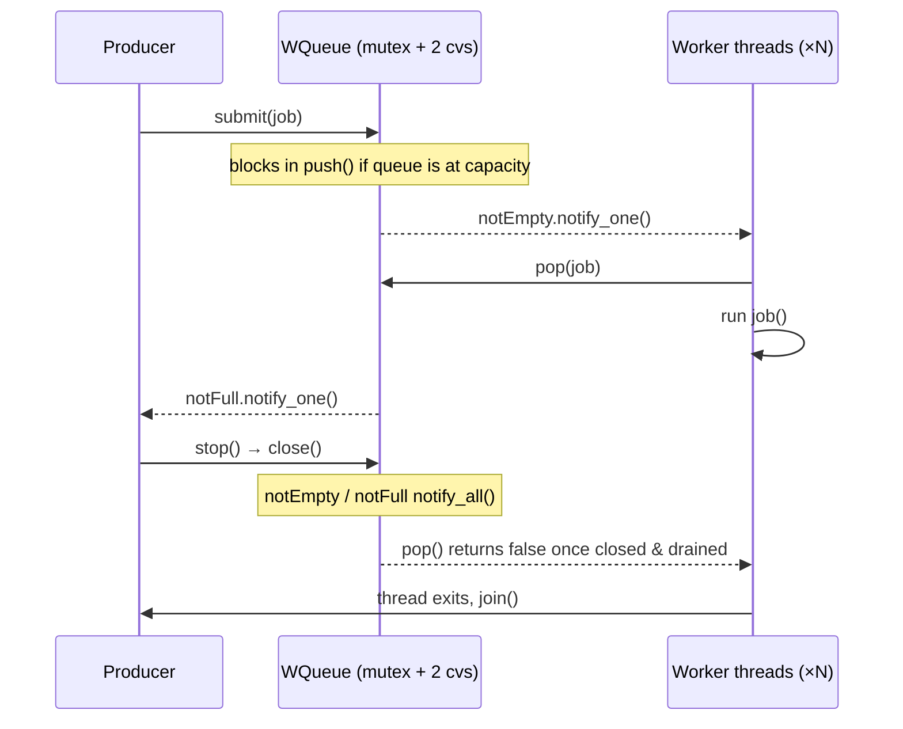

# work-queue

A multi-threaded job queue in C++17: a fixed pool of worker threads pulling
tasks off a shared bounded queue, with backpressure and graceful shutdown.
Two headers, no dependencies beyond the standard library.

## Design

**`WQueue<T>`** is a bounded blocking queue guarded by one mutex and two
condition variables. `notEmpty` wakes consumers when work arrives, `notFull`
wakes producers when space frees up. The capacity bound is what gives
backpressure: a producer that outruns the workers blocks in `push` instead of
letting the queue grow without limit.

**`Pool`** spawns N workers, each looping on `q.pop(j)` until the queue is
closed *and* drained. Shutdown closes the queue, which wakes every blocked
thread; workers finish the jobs still queued, then exit and are joined. No
detached threads, no jobs dropped.

Both condition variables are waited on with a predicate, so spurious wakeups
are handled correctly.



## Usage

Header-only. Drop `wqueue.h` and `pool.h` into your project, no build step
of their own.

```cpp
#include "pool.h"

Pool pool(4, /*capacity=*/1024);   // 4 workers, 1024-slot queue

pool.submit([] { std::cout << "job ran\n"; });
pool.submit([] { do_work(); });

pool.stop();                       // drains the queue, joins workers
std::cout << pool.completed();     // jobs actually run
```

`submit` returns `false` if the queue has already been closed. Check it if
jobs might be submitted concurrently with shutdown. `Pool`'s destructor calls
`stop()` too, so an explicit call is only needed if you want to block until
drain finishes before doing something else.

## Build & run

```bash
make
./wqueue
```

Requires a C++17 compiler and `make`.

## Tests

```bash
make test        # 10 tests for the queue and the pool
make test-tsan   # the same tests under ThreadSanitizer
```

[`test.cpp`](test.cpp) checks that:

- items come out in the order they went in
- `push` blocks on a full queue and `pop` blocks on an empty one
- `close()` wakes threads blocked on either side
- jobs queued before shutdown still run, and `submit` is refused after it
- 80,000 items pushed by 4 producers reach 4 consumers exactly once

It uses a small `CHECK` macro instead of a test framework, so the tests need
only the standard library, like the headers. As a check on the tests
themselves: changing `pop()` to stop as soon as the queue closes, instead of
after it drains, makes three tests fail. That bug would silently drop queued
jobs on shutdown.

## Benchmark

200,000 jobs, queue capacity 1024, measured end to end including shutdown.
Run in CI on a 4-vCPU AMD EPYC 7763 runner:

| Workers | Time     | Throughput   | Speedup |
|---------|----------|--------------|---------|
| 1       | 411.8 ms | 486k jobs/s  | 1.00x   |
| 2       | 189.5 ms | 1.06M jobs/s | 2.17x   |
| 4       | 159.6 ms | 1.25M jobs/s | 2.58x   |
| 8       | 189.5 ms | 1.06M jobs/s | 2.17x   |

What the numbers show:

- **Two workers beat 2x.** The single-worker baseline isn't a pure serial
  measurement. The producer fills the 1024-slot queue and then blocks in
  `push`, so producer and consumer end up ping-ponging. A second worker
  drains fast enough to keep the producer running, which removes stalls the
  baseline was paying for.
- **Four workers gain much less than the jump to two.** All four contend on
  one mutex for every push and pop, and the producer is itself a fifth thread
  competing for four cores. The queue, not the work, is now the limit.
- **Eight workers are slower than four.** Past the core count there are no
  spare cores to use, and the extra threads only add context switching and
  lock contention.

Per-worker queues with work stealing would cut the shared-mutex traffic and
be the natural next step.

## Checking for races

```bash
make tsan
./wqueue_tsan
```

Builds with ThreadSanitizer. The run above reported no data races and no
lost jobs. Expect a large slowdown under TSan, because every memory access is
instrumented, so the timings there measure the sanitizer, not the queue.

## CI

Every push runs the tests, the benchmark and both ThreadSanitizer builds on a
GitHub Actions runner ([`.github/workflows/benchmark.yml`](.github/workflows/benchmark.yml)).
The test steps have a timeout, so a thread that never wakes fails the build
instead of hanging it.
The numbers in this README came from that CI run, not a local machine, so
they should reproduce if you re-run the workflow.

## License

[MIT](LICENSE)
